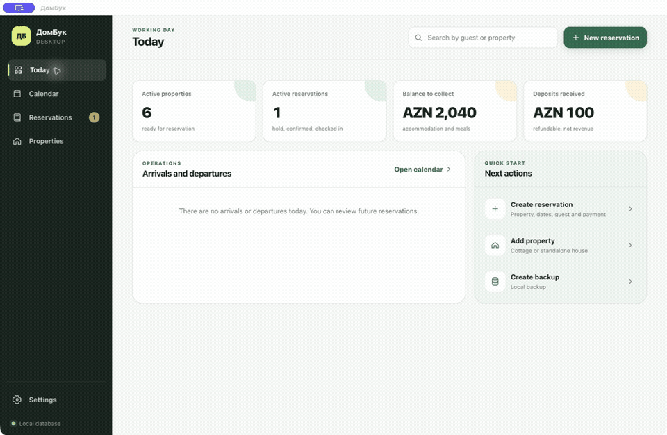

# DomBook

A simple booking system for vacation houses and cottages, available for macOS,
Windows, Linux and the Web.

**[Download the latest release](https://github.com/inajaf/dombook/releases/latest)**

User guides: **[English](docs/USER_GUIDE.en.md)** · **[Русский](docs/USER_GUIDE.ru.md)** · **[Azərbaycan](docs/USER_GUIDE.az.md)**

## Product tour



The lightweight 10-second preview shows the current desktop interface, clickable
calendar, resort and cottage hierarchy, reservation workflow, financial calculation,
daily meal support, language settings and local backups.

## MVP features

- dashboard and a clickable availability calendar;
- CRUD for resorts: create, edit, archive and restore;
- CRUD for bookable units: cottages inside a resort and standalone houses;
- CRUD for reservations with overlap protection;
- cancel active bookings and safely (permanently) remove completed or cancelled ones;
- automatic stay calculation based on nights × nightly rate;
- separate tracking of stay cost, prepaid amount and security deposit;
- daily meal charges (breakfast / lunch / dinner) for resorts with a kitchen;
- local SQLite database;
- manual backups with SHA-256 checksums;
- multilingual interface: русский, Azərbaycan, English;
- builds for macOS, Windows, Linux and Web.

## Getting started

```bash
npm install
npm start
```

To build and open the browser edition through a local web server:

```bash
npm run build:web
python3 -m http.server 8080 --directory release/web
```

## Tests

```bash
npm test
npm run test:smoke
```

## Where the database lives

In production the `dombook.sqlite` database is created in the Electron `userData`
directory. The Settings screen intentionally shows only safe file and folder names;
use its open-folder action when direct access is required.

The Web edition stores data in browser `localStorage` and exports JSON backups.
Use the desktop edition when SQLite storage and verified local backups are required.

## How objects are organized

A `resort` (дом отдыха) is a group with a shared name and address. Inside it the
owner creates several `cottages`, and each one gets its own calendar, price and
deposit. A `standalone house` is created without a group and booked independently.

## Booking policy

- check-in can be booked up to 21 days ahead;
- a stay can span at most 3 calendar months;
- "today" is resolved in the `Asia/Baku` time zone.

## Building

```bash
npm run build:mac
npm run build:win
npm run build:linux
npm run build:web
```

Each installer is most reliably built on its own OS through CI:
macOS on macOS, Windows on Windows, Linux on Linux.
